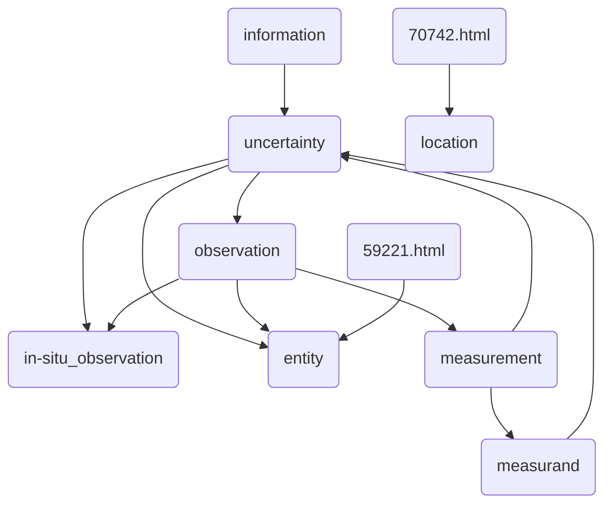

```mermaid
flowchart TD;
    id_uncertainty(uncertainty) --> id_in-situ_observation(in-situ_observation);
    id_uncertainty(uncertainty) --> id_entity(entity);
    id_uncertainty(uncertainty) --> id_observation(observation);
    id_observation(observation) --> id_in-situ_observation(in-situ_observation);
    id_observation(observation) --> id_entity(entity);
    id_observation(observation) --> id_measurement(measurement);
    id_59221.html(59221.html) --> id_entity(entity);
    id_70742.html(70742.html) --> id_location(location);
    id_measurement(measurement) --> id_measurand(measurand);
    id_measurement(measurement) --> id_uncertainty(uncertainty);
    id_measurand(measurand) --> id_uncertainty(uncertainty);
    id_information(information) --> id_uncertainty(uncertainty);
```
