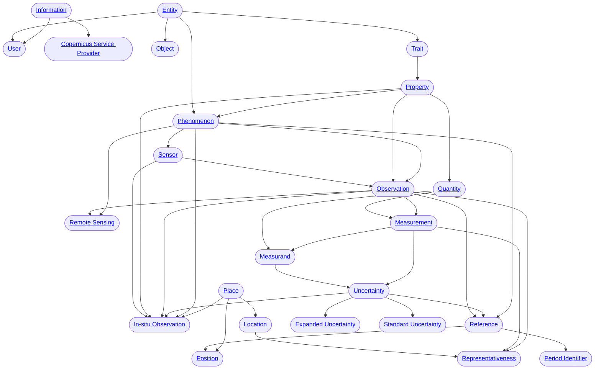

```mermaid
flowchart TD;
    id_place(["<a href='../place'>Place</a>"]) --> id_position(["<a href='../position'>Position</a>"]);
    id_place(["<a href='../place'>Place</a>"]) --> id_in-situ_observation(["<a href='../in-situ_observation'>In-situ Observation</a>"]);
    id_place(["<a href='../place'>Place</a>"]) --> id_location(["<a href='../location'>Location</a>"]);
    id_reference(["<a href='../reference'>Reference</a>"]) --> id_position(["<a href='../position'>Position</a>"]);
    id_reference(["<a href='../reference'>Reference</a>"]) --> id_period_identifier(["<a href='../period_identifier'>Period Identifier</a>"]);
    id_phenomenon(["<a href='../phenomenon'>Phenomenon</a>"]) --> id_observation(["<a href='../observation'>Observation</a>"]);
    id_phenomenon(["<a href='../phenomenon'>Phenomenon</a>"]) --> id_in-situ_observation(["<a href='../in-situ_observation'>In-situ Observation</a>"]);
    id_phenomenon(["<a href='../phenomenon'>Phenomenon</a>"]) --> id_remote_sensing(["<a href='../remote_sensing'>Remote Sensing</a>"]);
    id_phenomenon(["<a href='../phenomenon'>Phenomenon</a>"]) --> id_reference(["<a href='../reference'>Reference</a>"]);
    id_phenomenon(["<a href='../phenomenon'>Phenomenon</a>"]) --> id_sensor(["<a href='../sensor'>Sensor</a>"]);
    id_uncertainty(["<a href='../uncertainty'>Uncertainty</a>"]) --> id_expanded_uncertainty(["<a href='../expanded_uncertainty'>Expanded Uncertainty</a>"]);
    id_uncertainty(["<a href='../uncertainty'>Uncertainty</a>"]) --> id_reference(["<a href='../reference'>Reference</a>"]);
    id_uncertainty(["<a href='../uncertainty'>Uncertainty</a>"]) --> id_standard_uncertainty(["<a href='../standard_uncertainty'>Standard Uncertainty</a>"]);
    id_uncertainty(["<a href='../uncertainty'>Uncertainty</a>"]) --> id_in-situ_observation(["<a href='../in-situ_observation'>In-situ Observation</a>"]);
    id_observation(["<a href='../observation'>Observation</a>"]) --> id_in-situ_observation(["<a href='../in-situ_observation'>In-situ Observation</a>"]);
    id_observation(["<a href='../observation'>Observation</a>"]) --> id_measurement(["<a href='../measurement'>Measurement</a>"]);
    id_observation(["<a href='../observation'>Observation</a>"]) --> id_representativeness(["<a href='../representativeness'>Representativeness</a>"]);
    id_observation(["<a href='../observation'>Observation</a>"]) --> id_remote_sensing(["<a href='../remote_sensing'>Remote Sensing</a>"]);
    id_observation(["<a href='../observation'>Observation</a>"]) --> id_reference(["<a href='../reference'>Reference</a>"]);
    id_measurement(["<a href='../measurement'>Measurement</a>"]) --> id_representativeness(["<a href='../representativeness'>Representativeness</a>"]);
    id_measurement(["<a href='../measurement'>Measurement</a>"]) --> id_measurand(["<a href='../measurand'>Measurand</a>"]);
    id_measurement(["<a href='../measurement'>Measurement</a>"]) --> id_uncertainty(["<a href='../uncertainty'>Uncertainty</a>"]);
    id_measurand(["<a href='../measurand'>Measurand</a>"]) --> id_uncertainty(["<a href='../uncertainty'>Uncertainty</a>"]);
    id_information(["<a href='../information'>Information</a>"]) --> id_user(["<a href='../user'>User</a>"]);
    id_information(["<a href='../information'>Information</a>"]) --> id_copernicus_service_provider(["<a href='../copernicus_service_provider'>Copernicus Service Provider</a>"]);
    id_property(["<a href='../property'>Property</a>"]) --> id_quantity(["<a href='../quantity'>Quantity</a>"]);
    id_property(["<a href='../property'>Property</a>"]) --> id_observation(["<a href='../observation'>Observation</a>"]);
    id_property(["<a href='../property'>Property</a>"]) --> id_in-situ_observation(["<a href='../in-situ_observation'>In-situ Observation</a>"]);
    id_property(["<a href='../property'>Property</a>"]) --> id_phenomenon(["<a href='../phenomenon'>Phenomenon</a>"]);
    id_entity(["<a href='../entity'>Entity</a>"]) --> id_object(["<a href='../object'>Object</a>"]);
    id_entity(["<a href='../entity'>Entity</a>"]) --> id_user(["<a href='../user'>User</a>"]);
    id_entity(["<a href='../entity'>Entity</a>"]) --> id_phenomenon(["<a href='../phenomenon'>Phenomenon</a>"]);
    id_entity(["<a href='../entity'>Entity</a>"]) --> id_trait(["<a href='../trait'>Trait</a>"]);
    id_trait(["<a href='../trait'>Trait</a>"]) --> id_property(["<a href='../property'>Property</a>"]);
    id_quantity(["<a href='../quantity'>Quantity</a>"]) --> id_measurand(["<a href='../measurand'>Measurand</a>"]);
    id_quantity(["<a href='../quantity'>Quantity</a>"]) --> id_measurement(["<a href='../measurement'>Measurement</a>"]);
    id_sensor(["<a href='../sensor'>Sensor</a>"]) --> id_observation(["<a href='../observation'>Observation</a>"]);
    id_sensor(["<a href='../sensor'>Sensor</a>"]) --> id_in-situ_observation(["<a href='../in-situ_observation'>In-situ Observation</a>"]);
    id_location(["<a href='../location'>Location</a>"]) --> id_representativeness(["<a href='../representativeness'>Representativeness</a>"]);
```
