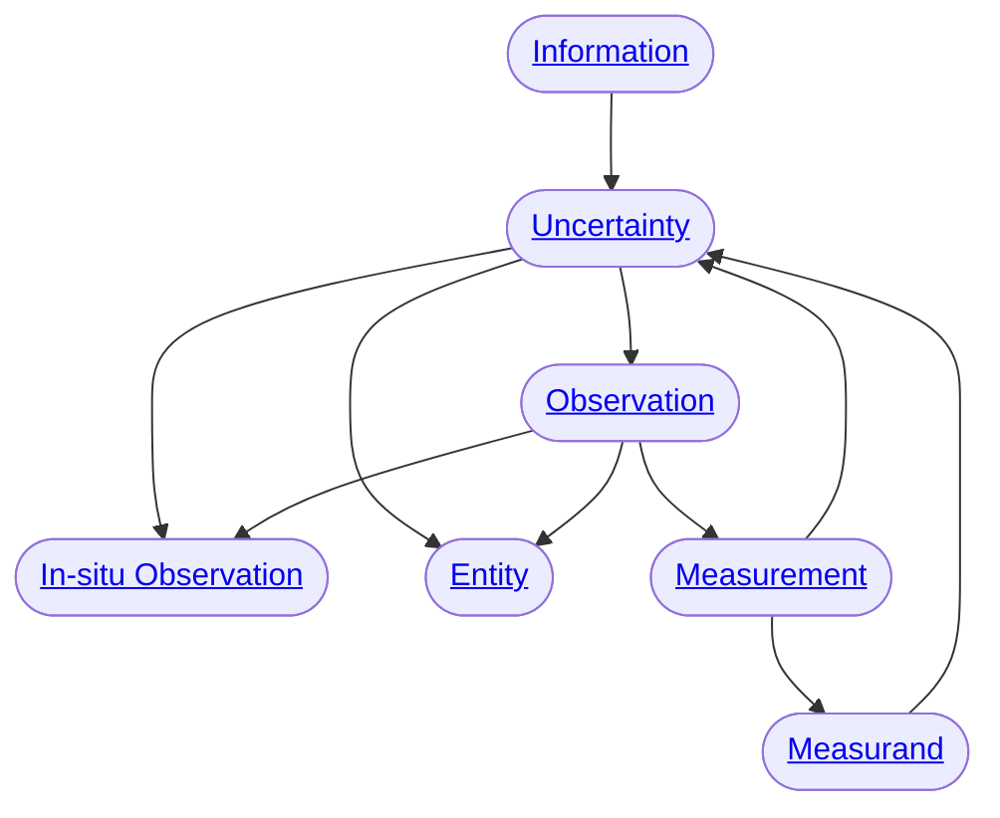

```mermaid
flowchart TD;
    id_uncertainty(["<a href='../uncertainty'>Uncertainty</a>"]) --> id_observation(["<a href='../observation'>Observation</a>"]);
    id_uncertainty(["<a href='../uncertainty'>Uncertainty</a>"]) --> id_in-situ_observation(["<a href='../in-situ_observation'>In-situ Observation</a>"]);
    id_uncertainty(["<a href='../uncertainty'>Uncertainty</a>"]) --> id_entity(["<a href='../entity'>Entity</a>"]);
    id_observation(["<a href='../observation'>Observation</a>"]) --> id_in-situ_observation(["<a href='../in-situ_observation'>In-situ Observation</a>"]);
    id_observation(["<a href='../observation'>Observation</a>"]) --> id_measurement(["<a href='../measurement'>Measurement</a>"]);
    id_observation(["<a href='../observation'>Observation</a>"]) --> id_entity(["<a href='../entity'>Entity</a>"]);
    id_measurement(["<a href='../measurement'>Measurement</a>"]) --> id_measurand(["<a href='../measurand'>Measurand</a>"]);
    id_measurement(["<a href='../measurement'>Measurement</a>"]) --> id_uncertainty(["<a href='../uncertainty'>Uncertainty</a>"]);
    id_measurand(["<a href='../measurand'>Measurand</a>"]) --> id_uncertainty(["<a href='../uncertainty'>Uncertainty</a>"]);
    id_information(["<a href='../information'>Information</a>"]) --> id_uncertainty(["<a href='../uncertainty'>Uncertainty</a>"]);
```
