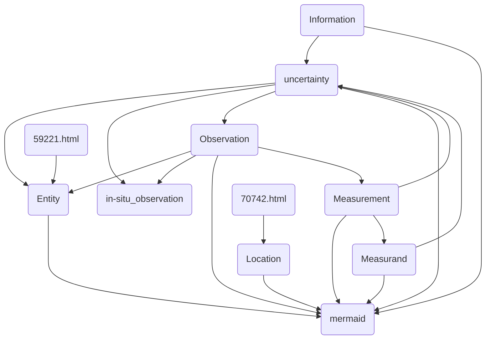

```mermaid
flowchart TD;
    id_uncertainty(Uncertainty) --> id_entity(entity);
    id_uncertainty(Uncertainty) --> id_in-situ_observation(in-situ_observation);
    id_uncertainty(Uncertainty) --> id_observation(observation);
    id_uncertainty(Uncertainty) --> id_mermaid(mermaid);
    id_observation(Observation) --> id_entity(entity);
    id_observation(Observation) --> id_in-situ_observation(in-situ_observation);
    id_observation(Observation) --> id_mermaid(mermaid);
    id_observation(Observation) --> id_measurement(measurement);
    id_59221.html(59221.html) --> id_entity(entity);
    id_70742.html(70742.html) --> id_location(location);
    id_measurement(Measurement) --> id_uncertainty(uncertainty);
    id_measurement(Measurement) --> id_mermaid(mermaid);
    id_measurement(Measurement) --> id_measurand(measurand);
    id_measurand(Measurand) --> id_uncertainty(uncertainty);
    id_measurand(Measurand) --> id_mermaid(mermaid);
    id_information(Information) --> id_uncertainty(uncertainty);
    id_information(Information) --> id_mermaid(mermaid);
    id_entity(Entity) --> id_mermaid(mermaid);
    id_location(Location) --> id_mermaid(mermaid);
```
